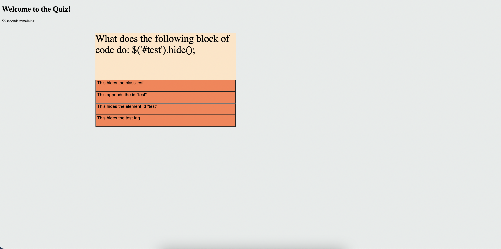

# Project Title: Online Quiz

## Name: Abdul Khalil
## [GitHub](https://github.com/absk786)
deployed site - https://absk786.github.io/assignment4/ 

## Table of Contents:
* [Description](https://github.com/absk786/assignment7/blob/main/README.md#Description)
* [Installation](https://github.com/absk786/assignment7/blob/main/README.md#Installation)
* [Usage](https://github.com/absk786/assignment7/blob/main/README.md#Usage)
* [Licences](https://github.com/absk786/assignment7/blob/main/README.md#License)
* [Languages](https://github.com/absk786/assignment7/blob/main/README.md#Languages)
* [Features](https://github.com/absk786/assignment7/blob/main/README.md#Features)
* [Tests](https://github.com/absk786/assignment7/blob/main/README.md#Tests)
* [Contributors](https://github.com/absk786/assignment7/blob/main/README.md#Contributors)

-------------------------------------------------------------------------------------
### Description: 
* for this assignment we were required to build a quiz with a timer. We used local storage for score presistance and time interval to generate final scores.

### Installation: 
* no packages were installed
 
### Usage: 
* undefined

### Languages: 
* JavaScript,HTML,CSS

### License:
* MIT 

### Features: 
* na

### Tests: 
* no tests are done as part of this

### Contributors: 
* Other are welcome to contribute

Questions
* for more questions please email me at rehmank11@gmail.com
